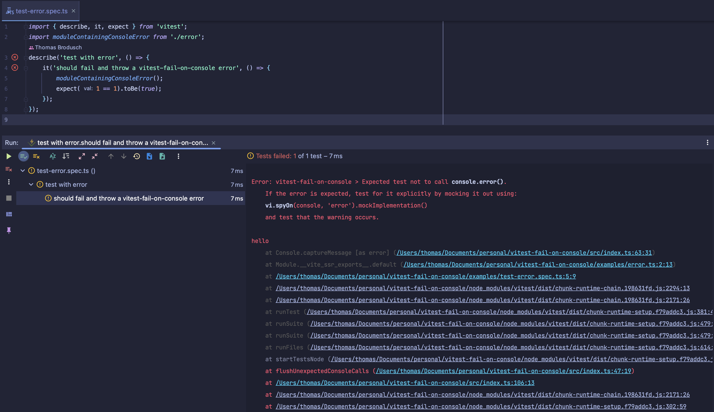

# vitest-fail-on-console

Utility to make vitest tests fail when `console.error()`, `console.warn()`, etc. are used


[![version][version-badge]][package] [![Monthly downloads][npmstats-badge]][npmstats] [![MIT License][license-badge]][license] [![PRs Welcome][prs-badge]][prs]

## What problem is this solving?

Vitest doesn't fail the tests when there is a `console.error`. In large codebase, we can end up with the test output overloaded by a lot of errors, warnings, etc..
To prevent this, we want to fail each test that is logging to the console. We also want to conserve a clear output of the original error.

This is what this utility is doing.



## How this project is different from `jest-fail-on-console`?

There is several changes between `jest-fail-on-console` and `vitest-fail-on-console`:

- TypeScript typed functions, arguments, and variables - [see types.ts](./src/types.ts)
- refactoring of the whole codebase
- refactoring of test/specs

This repository has been developed and publish to keep and maintain a Vitest version 
of the original idea behind `jest-fail-on-console` credited at the bottom of this file.

## Install

```shell
yarn add -D vitest-fail-on-console
```

or

```shell
npm install -D vitest-fail-on-console
```

## How to use

In a file used in the `setupFiles` option of Vitest's config file (`vitest.config.ts`), add this code:

```ts
// tests/setup.ts
import failOnConsole from 'vitest-fail-on-console'

failOnConsole()

// or with options:
failOnConsole({
  shouldFailOnWarn: false,
})
```


```ts
// vitest.config.ts
import { defineConfig } from "vitest/config";
export default defineConfig({
    test: {
        environment: "node",
        setupFiles: ["tests/setup.ts"],
    },
});

```
## But I have some expected console errors/warning

If a `console.error()` is expected, then you should assert for it:

```ts
test('should log an error', () => {
  vi.spyOn(console, 'error').mockImplementation(() => {})
  // do your logic
  expect(console.error).toHaveBeenCalledWith('your error message')
})
```

## Options

You can pass an object with options to the function:

### errorMessage

Use this if you want to override the default error message of this library.

```ts
// signature
type errorMessage = (
  methodName: 'assert' | 'debug' | 'error' | 'info' | 'log' | 'warn',
  bold: (string: string) => string
) => string
```

### shouldFailOnAssert

Use this to make a test fail when a `console.assert()` is logged.

- Type: `boolean`
- Default: `false`

### shouldFailOnDebug

Use this to make a test fail when a `console.debug()` is logged.

- Type: `boolean`
- Default: `false`

### shouldFailOnError

Use this to make a test fail when a `console.error()` is logged.

- Type: `boolean`
- Default: `true`

### shouldFailOnInfo

Use this to make a test fail when a `console.info()` is logged.

- Type: `boolean`
- Default: `false`

### shouldFailOnLog

Use this to make a test fail when a `console.log()` is logged.

- Type: `boolean`
- Default: `false`

### shouldFailOnWarn

Use this to make a test fail when a `console.warn()` is logged.

- Type: `boolean`
- Default: `true`

### silenceMessage

```ts
// signature
type silenceMessage = (
  message: string,
  methodName: 'assert' | 'debug' | 'error' | 'info' | 'log' | 'warn'
) => boolean
```

This function is called for every console method supported by this utility.
If `true` is returned, the message will not show in the console and the test won't fail.

Example:

```ts
failOnConsole({
  silenceMessage: (errorMessage) => {
    if (/Not implemented: navigation/.test(errorMessage)) {
      return true
    }
    return false
  },
})
```

### skipTest

Use this if you want to ignore checks introduced by this library for specific tests determined by
the return of the callback function. Return `false` if you do not want to skip console checks for
the specific test and return `true` if you would like to skip it.

```ts
const ignoreList = [/.*components\/SomeComponent.test.tsx/]
const ignoreNameList = ['some component some test name']

failOnConsole({
  skipTest: ({ testPath, testName }) => {
    for (const pathExp of ignoreList) {
      const result = pathExp.test(testPath)
      if (result) return true
    }

    if (ignoreNameList.includes(testName)) {
      return true
    }
    
    return false
  },
})
```

### afterEachDelay

Use this to make sure test fails even when the console warning is called after the test finished executing. This is useful for debugging flaky tests. It's recommended to turn it off for CI (or set it to a low value) as it will slow down test execution

- Type: `number`
- Default: `0`

```ts
failOnConsole({
  afterEachDelay: !process.env.CI ? 1000 : 0,
})
```

## License

[MIT](https://github.com/thomasbroduch/vitest-fail-on-console/blob/develop/LICENSE)

## Credits

Most of the logic is taken from :
- [React's setupTests file](https://github.com/facebook/react/blob/main/scripts/jest/setupTests.js)
- [*jest-fail-on-console*](https://github.com/ValentinH/jest-fail-on-console/)

[version-badge]: https://img.shields.io/npm/v/vitest-fail-on-console.svg?style=flat-square
[package]: https://www.npmjs.com/package/vitest-fail-on-console
[downloads-badge]: https://img.shields.io/npm/dm/vitest-fail-on-console.svg?style=flat-square
[npmstats]: http://npm-stat.com/charts.html?package=vitest-fail-on-console
[npmstats-badge]: https://img.shields.io/npm/dm/vitest-fail-on-console.svg?style=flat-square
[license-badge]: https://img.shields.io/badge/license-MIT-blue.svg?style=flat-square
[license]: https://github.com/ValentinH/vitest-fail-on-console/blob/master/LICENSE
[prs-badge]: https://img.shields.io/badge/PRs-welcome-brightgreen.svg?style=flat-square
[prs]: http://makeapullrequest.com
